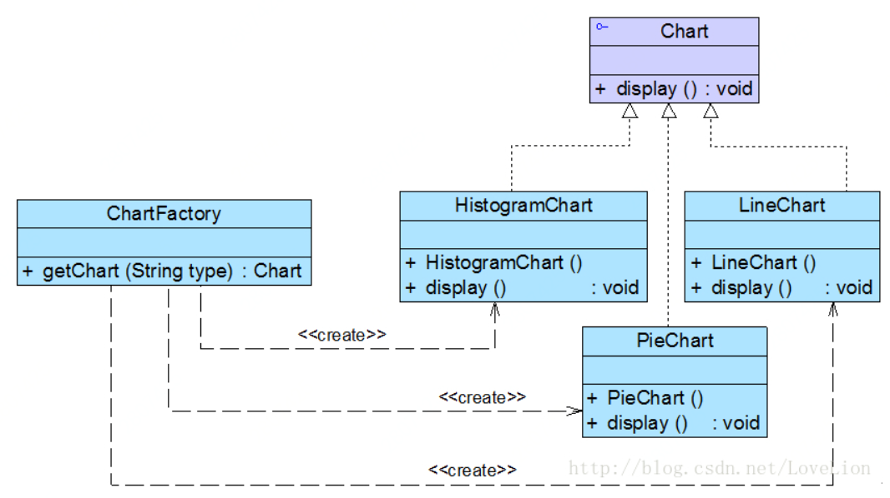
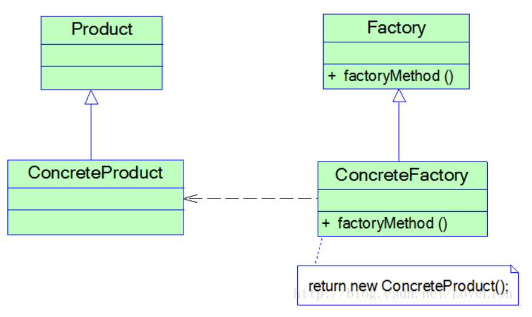
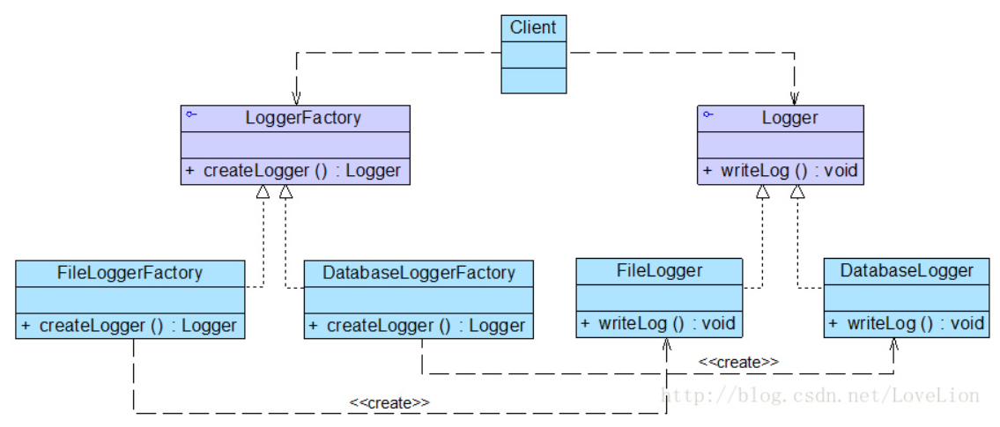
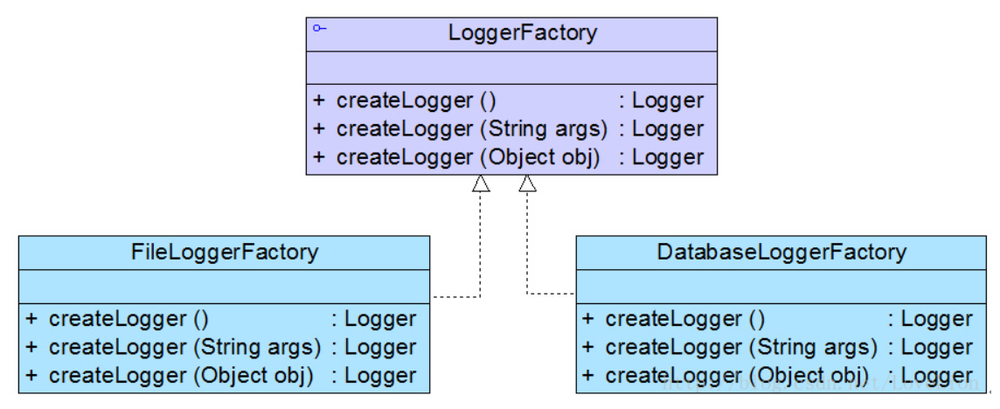
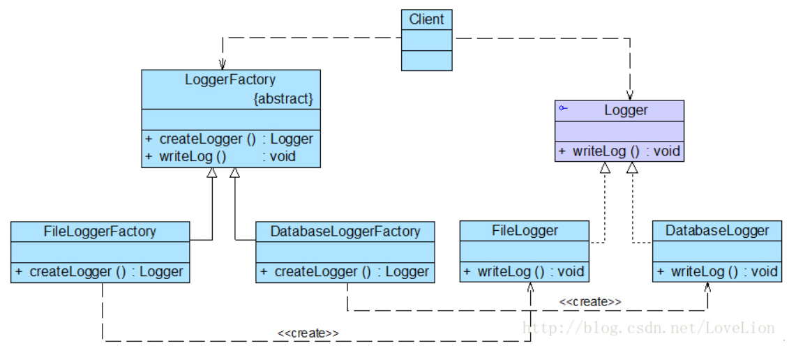

# 设计模式

## 创建型模式

为了对象创建使用，讲对象的创建和使用分离

## 结构型模式

为了类直接关系的协调性

## 行为型模式

为了类协调完成某种类型动作

# 设计原则

## 开闭原则

对添加开放，对修改关闭

## 里氏代换原则里（不太理解）

子类可以扩展父类的功能，但不能重写父类的功能

## 依赖倒转原则

高层模块不依赖底层模块，应该依赖于其的抽象类。抽象不依赖于细节（具体的实现类），细节应该依赖于抽象类

比如A类 依赖 B类，应该依赖B类的抽象类或者接口

## 接口隔离原则

一个类对于另一个类的依赖应该在最小的接口上

B类有2个方法b1，b2，A类依赖B类b1方法，这时应该让B类实现b1接口，A类依赖于b1接口

## 迪米特原则

迪米特原则又是最小知道原则，即只和你对接的人交流，不和陌生人交流。如果两个软件实体无需直接通信，那么就不应该发生直接调用行为，应该通过第三方转发调用。

例如明星，经纪人，粉丝。

明星不需要和粉丝直接对接事务，明星通过经纪人和粉丝进行交流。类似于代理。

## 合成复用原则

能组合使用绝对不要继承使用，继承会破坏父类的封装性，报漏出父类实现细节。

# 单例模式

属于创建者模式，提供了一种创建对象的最佳方式，一个类只能创建唯一的一个访问对象，需要提供接口供对外直接获取对象、而不用创建。

## 饿汉式

类加载时就会创建对象

缺点很明显，如果不使用，它也会一直会存在，保存在内存中。

## 懒汉式

类加载时不会创建，使用时才会创建

# 简单工厂模式

## 类图

## 完整实现版

# 工厂方法模式

## 类图

工厂也抽象。

## 完整版类图

Logger日志输出

## 重载的工厂方式

可以隐藏类内部的创建和使用细节
